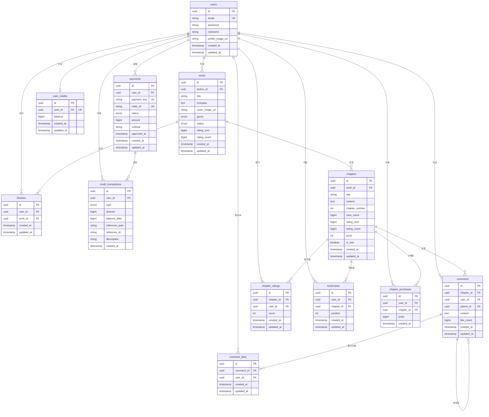

# StoRead Backend

작가가 관리하던 원고를 외부로 배포하고, 독자가 이를 소비하며 피드백을 남길 수 있는 소셜 기능을 담당하는 Spring Boot 백엔드 서버입니다.

## 기술 스택

- **Spring Boot**: 3.4.1
- **Java**: 21 (AWS Amazon Corretto)
- **Database**: PostgreSQL 16.11
- **Authentication**: Spring Security + JWT + Google OAuth2
- **Payment**: Toss Payments (토스페이먼츠)

## 주요 기능

### 1. 인증 (Auth)

- JWT 토큰 기반 인증 (stolink_spring과 공유)
- Google OAuth2 소셜 로그인
- Access Token / Refresh Token 관리 (쿠키 기반)
- 회원가입, 로그인, 프로필 관리

### 2. 작품 관리 (Works) - 작가용

- 작품 메타데이터 설정 (표지, 장르, 줄거리)
- 작품 CRUD
- 연재 상태 관리 (연재중/휴재/완결)

### 3. 챕터 관리 (Chapters) - 작가용

- 회차별 원고 배포
- 챕터 순서 관리 (중간 삽입/삭제 시 자동 재정렬)
- 조회수 집계
- 유료 챕터 설정 (크레딧 소모)

### 4. 독자 탐색 (Discovery) - 공개 API

- 공개 작품 목록 조회
- 제목/작가명 검색
- 카테고리/장르별 필터링
- 작품 상세 및 챕터 열람

### 5. 커뮤니티 (Social)

- 챕터별 별점 (1~10점, 1인 1회)
- 계층형 댓글 시스템 (대댓글 지원)
- 댓글 좋아요

### 6. 커뮤니티 발행 (Community Publish)

- StoLink에서 작성한 원고를 StoRead에 발행
- Draft 기반 Work + Chapter 생성

### 7. 라이브러리 (Library)

- 선호 작품 등록 (내 서재)

### 8. 북마크 (Bookmark)

- 챕터별 읽은 위치 저장
- 이어읽기 지원

### 9. 드래프트 (Draft)

- 임시저장 원고 관리

### 10. 결제 시스템 (Payment)

- **토스페이먼츠 연동**: 크레딧 충전
- **크레딧 관리**: 잔액 조회, 사용, 거래 내역
- **챕터 구매**: 유료 챕터 크레딧 결제
- **결제 내역**: 결제/취소 이력 관리
- **Webhook**: 결제 상태 콜백 처리

## 시작하기

### 사전 요구사항

- Java 21+
- Docker & Docker Compose

### 1. 로컬 개발 (권장)

StoRead는 StoLink와 인프라(PostgreSQL, Neo4j)를 공유합니다.

```bash
# 1. stolink_spring 먼저 실행 (PostgreSQL, Neo4j 제공)
cd ../stolink_spring
docker-compose -f docker-compose.local.yml up -d

# 2. storead_spring 실행
cd ../storead_spring
docker-compose -f docker-compose.local.yml up --build -d
```

다음 서비스가 시작됩니다:

- **StoRead Backend**: `localhost:8081`
- **StoLink Backend**: `localhost:8080` (stolink_spring)
- **PostgreSQL**: `localhost:5432` (stolink_spring 제공)
- **Neo4j**: `localhost:7687` (stolink_spring 제공)

### 2. IDE에서 직접 실행

```bash
# 데이터베이스 컨테이너 실행 (stolink_spring)
cd ../stolink_spring
docker-compose -f docker-compose.local.yml up -d postgres neo4j

# 환경변수 설정 (.env 파일 또는 IDE 환경변수)
# 필수: JWT_SECRET (stolink_spring과 동일해야 함)

# 백엔드 실행
gradlew.bat bootRun  # Windows
./gradlew bootRun    # Linux/Mac
```

### 3. 프로덕션/스테이징 배포

```bash
docker-compose up -d
```

## 프로젝트 구조

```
src/main/java/com/stolink/backend/
├── global/
│   ├── common/         # 공통 DTO, 엔티티, 예외
│   ├── config/         # 설정 (CORS, JPA)
│   ├── security/       # JWT 인증, Spring Security
│   └── util/           # 유틸리티
├── domain/
│   ├── user/           # 사용자 인증
│   ├── work/           # 작품 관리
│   ├── chapter/        # 챕터/회차 관리
│   ├── comment/        # 댓글 시스템
│   ├── like/           # 댓글 좋아요
│   ├── rating/         # 챕터 별점
│   ├── library/        # 선호 작품 관리
│   ├── bookmark/       # 북마크/이어읽기
│   ├── discovery/      # 작품 탐색 (Public)
│   ├── draft/          # 임시저장 원고
│   ├── community/      # 커뮤니티 발행 (StoLink → StoRead)
│   ├── payment/        # 결제 시스템 (토스페이먼츠, 크레딧)
│   ├── stats/          # 통계
│   └── document/       # 문서 관련
└── BackendApplication.java
```

## API 명세

### 인증

| Method | Endpoint             | 설명               |
| ------ | -------------------- | ------------------ |
| POST   | `/api/auth/register` | 회원가입           |
| POST   | `/api/auth/login`    | 로그인             |
| POST   | `/api/auth/refresh`  | Access Token 갱신  |
| POST   | `/api/auth/logout`   | 로그아웃           |
| GET    | `/api/auth/me`       | 내 정보 조회       |
| PATCH  | `/api/auth/me`       | 프로필 수정        |

### OAuth2 (Google)

| Method | Endpoint                        | 설명               |
| ------ | ------------------------------- | ------------------ |
| GET    | `/oauth2/authorization/google`  | Google 로그인 시작 |
| GET    | `/login/oauth2/code/google`     | OAuth2 콜백        |

### 작품 (작가용)

| Method | Endpoint           | 설명        |
| ------ | ------------------ | ----------- |
| GET    | `/api/works`       | 내 작품 목록 |
| POST   | `/api/works`       | 작품 생성   |
| GET    | `/api/works/{id}`  | 작품 상세   |
| PATCH  | `/api/works/{id}`  | 작품 수정   |
| DELETE | `/api/works/{id}`  | 작품 삭제   |

### 챕터 (작가용)

| Method | Endpoint                        | 설명        |
| ------ | ------------------------------- | ----------- |
| GET    | `/api/works/{workId}/chapters`  | 챕터 목록   |
| POST   | `/api/works/{workId}/chapters`  | 챕터 생성   |
| GET    | `/api/chapters/{id}`            | 챕터 상세   |
| PATCH  | `/api/chapters/{id}`            | 챕터 수정   |
| DELETE | `/api/chapters/{id}`            | 챕터 삭제   |

### 탐색 (Public)

| Method | Endpoint                       | 설명                |
| ------ | ------------------------------ | ------------------- |
| GET    | `/api/discovery`               | 공개 작품 목록      |
| GET    | `/api/discovery/search`        | 작품 검색           |
| GET    | `/api/discovery/works/{id}`    | 작품 상세 (공개용)  |
| GET    | `/api/discovery/chapters/{id}` | 챕터 열람 (공개용)  |

### 별점

| Method | Endpoint                     | 설명                   |
| ------ | ---------------------------- | ---------------------- |
| POST   | `/api/chapters/{id}/rating`  | 챕터 별점 등록/수정    |
| GET    | `/api/chapters/{id}/rating`  | 내 별점 + 평균 조회    |
| DELETE | `/api/chapters/{id}/rating`  | 별점 삭제              |
| GET    | `/api/works/{id}/rating`     | 작품 전체 별점 조회    |

### 댓글

| Method | Endpoint                              | 설명                        |
| ------ | ------------------------------------- | --------------------------- |
| GET    | `/api/chapters/{chapterId}/comments`  | 댓글 목록 (페이지네이션)    |
| POST   | `/api/chapters/{chapterId}/comments`  | 댓글 작성                   |
| GET    | `/api/comments/{id}/replies`          | 대댓글 조회 (Lazy Loading)  |
| POST   | `/api/comments/{id}/replies`          | 대댓글 작성                 |
| DELETE | `/api/comments/{id}`                  | 댓글 삭제                   |

### 댓글 좋아요

| Method | Endpoint                  | 설명            |
| ------ | ------------------------- | --------------- |
| POST   | `/api/comments/{id}/like` | 댓글 좋아요 토글 |

### 라이브러리

| Method | Endpoint                | 설명        |
| ------ | ----------------------- | ----------- |
| GET    | `/api/library`          | 내 서재 목록 |
| POST   | `/api/library/{workId}` | 작품 담기   |
| DELETE | `/api/library/{workId}` | 작품 제거   |

### 북마크

| Method | Endpoint                             | 설명                 |
| ------ | ------------------------------------ | -------------------- |
| GET    | `/api/bookmarks/{chapterId}`         | 북마크 조회          |
| POST   | `/api/bookmarks/{chapterId}`         | 북마크 저장/수정     |
| GET    | `/api/works/{workId}/reading-progress` | 작품별 읽기 진행도 |

### 커뮤니티 발행

| Method | Endpoint               | 설명                            |
| ------ | ---------------------- | ------------------------------- |
| POST   | `/api/community/publish` | Draft → Work + Chapter 발행   |

### 결제 (토스페이먼츠)

| Method | Endpoint                       | 설명                  |
| ------ | ------------------------------ | --------------------- |
| POST   | `/api/payments/prepare`        | 결제 준비 (주문 생성) |
| POST   | `/api/payments/confirm`        | 결제 승인             |
| POST   | `/api/payments/{id}/cancel`    | 결제 취소             |
| GET    | `/api/payments`                | 결제 내역 조회        |
| GET    | `/api/payments/{id}`           | 결제 상세 조회        |
| GET    | `/api/payments/packages`       | 크레딧 패키지 목록    |

### 크레딧

| Method | Endpoint                    | 설명                   |
| ------ | --------------------------- | ---------------------- |
| GET    | `/api/credits`              | 크레딧 잔액 조회       |
| POST   | `/api/credits/use`          | 크레딧 사용 (챕터 구매) |
| GET    | `/api/credits/check`        | 사용 가능 여부 확인    |
| GET    | `/api/credits/transactions` | 크레딧 거래 내역       |

## 환경 변수

### 필수

| 변수명                 | 설명                                       |
| ---------------------- | ------------------------------------------ |
| `JWT_SECRET`           | JWT 서명 키 (stolink_spring과 동일해야 함) |
| `POSTGRESQL_URL`       | PostgreSQL 호스트                          |
| `POSTGRESQL_PORT`      | PostgreSQL 포트 (기본: 5432)               |
| `POSTGRESQL_USERNAME`  | PostgreSQL 사용자명                        |
| `POSTGRESQL_PASSWORD`  | PostgreSQL 비밀번호                        |
| `GOOGLE_CLIENT_ID`     | Google OAuth2 클라이언트 ID                |
| `GOOGLE_CLIENT_SECRET` | Google OAuth2 클라이언트 시크릿            |

### 결제 (토스페이먼츠)

| 변수명                 | 설명                           |
| ---------------------- | ------------------------------ |
| `TOSS_SECRET_KEY`      | 토스페이먼츠 시크릿 키         |
| `TOSS_CLIENT_KEY`      | 토스페이먼츠 클라이언트 키     |
| `TOSS_WEBHOOK_SECRET`  | 토스페이먼츠 웹훅 시크릿       |
| `TOSS_TEST_MODE`       | 테스트 모드 여부 (기본: false) |

### 선택

| 변수명                 | 설명                  | 기본값                                |
| ---------------------- | --------------------- | ------------------------------------- |
| `JWT_COOKIE_DOMAIN`    | JWT 쿠키 도메인       | localhost                             |
| `CORS_ALLOWED_ORIGINS` | CORS 허용 origins     | http://localhost:3000,5173,5174       |
| `OAUTH2_REDIRECT_URI`  | OAuth2 리다이렉트 URI | http://localhost:5174/oauth2/callback |

## 데이터베이스 스키마

### ERD



### 테이블 설명

| 테이블               | 설명                                                      |
| -------------------- | --------------------------------------------------------- |
| `users`              | 사용자 정보                                               |
| `works`              | 작품 (제목, 줄거리, 표지, 장르, 연재상태, 별점 합계/개수) |
| `chapters`           | 챕터/회차 (본문, 순서, 조회수, 별점 합계/개수, 가격)      |
| `comments`           | 댓글 (Self-referencing 구조, like_count 포함)             |
| `chapter_ratings`    | 챕터 별점 (1~10점, 중복 방지)                             |
| `comment_likes`      | 댓글 좋아요 (중복 방지)                                   |
| `libraries`          | 선호 작품 (내 서재)                                       |
| `bookmarks`          | 읽은 위치 저장                                            |
| `user_credits`       | 사용자별 크레딧 잔액                                      |
| `credit_transactions`| 크레딧 충전/사용 거래 내역                                |
| `payments`           | 토스페이먼츠 결제 기록                                    |
| `chapter_purchases`  | 유료 챕터 구매 기록                                       |

## 챕터 순서 관리

- 삭제 시: 해당 작품의 더 큰 chapter_number를 가진 회차 번호 -1
- 중간 삽입 시: 삽입 지점 이후 회차 번호 +1

## 포트 설정

| 환경      | StoRead Backend      | StoLink Backend | PostgreSQL | Neo4j |
| --------- | -------------------- | --------------- | ---------- | ----- |
| 로컬 개발 | 8081                 | 8080            | 5432       | 7687  |
| EC2 배포  | 8080 (별도 인스턴스) | 8080            | RDS        | -     |

## 관련 프로젝트

- **[StoLink Backend](../stolink_spring)**: 작가용 스토리 관리 플랫폼 (에디터, 인프라 제공)
- **[StoRead Frontend](../storead_frontend)**: React + TypeScript 프론트엔드
- **[StoLink Frontend](../stolink_frontend)**: 작가용 웹 애플리케이션
