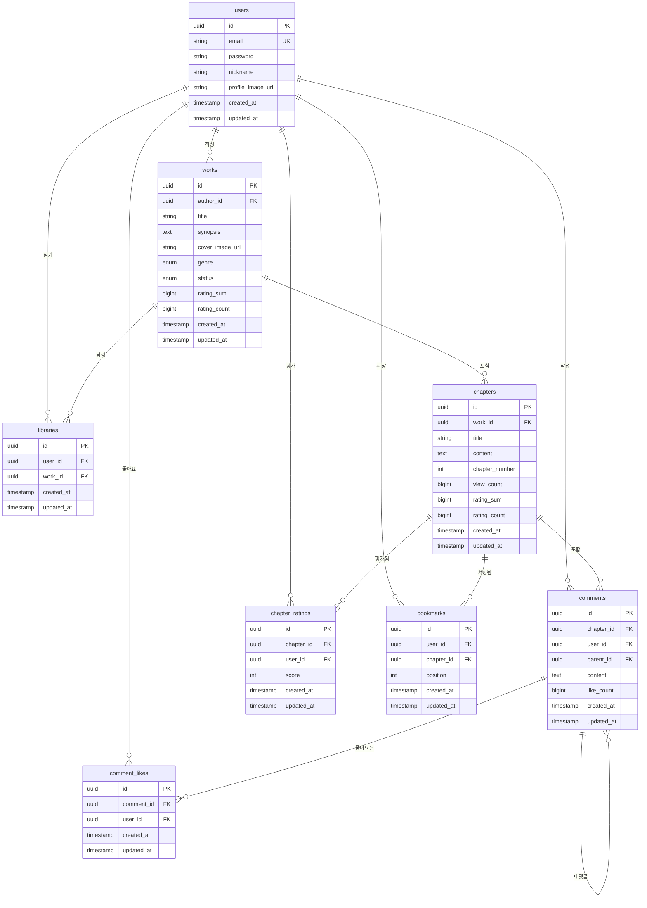

# StoRead Backend

작가가 관리하던 원고를 외부로 배포하고, 독자가 이를 소비하며 피드백을 남길 수 있는 소셜 기능을 담당하는 Spring Boot 백엔드 서버입니다.

## 기술 스택

- **Spring Boot**: 3.4.1
- **Java**: 21 (AWS Amazon Corretto)
- **Database**: PostgreSQL 16.11

## 주요 기능

### 1. 인증 (Auth)

- 간단한 헤더 기반 인증 (`X-User-Id`)
- 회원가입, 로그인
- 프로필 관리

### 2. 작품 관리 (Works) - 작가용

- 작품 메타데이터 설정 (표지, 장르, 줄거리)
- 작품 CRUD
- 연재 상태 관리 (연재중/휴재/완결)

### 3. 챕터 관리 (Chapters) - 작가용

- 회차별 원고 배포
- 챕터 순서 관리 (중간 삽입/삭제 시 자동 재정렬)
- 조회수 집계

### 4. 독자 탐색 (Discovery) - 공개 API

- 공개 작품 목록 조회
- 제목/작가명 검색
- 작품 상세 및 챕터 열람

### 5. 커뮤니티 (Social)

- 챕터별 별점 (1~10점, 1인 1회)
- 계층형 댓글 시스템 (대댓글 지원)
- 댓글 좋아요

### 6. 라이브러리 (Library)

- 선호 작품 등록 (내 서재)

### 7. 북마크 (Bookmark)

- 챕터별 읽은 위치 저장
- 이어읽기 지원

## 시작하기

### 사전 요구사항

- Java 21+
- Docker & Docker Compose

### 1. Docker로 전체 실행 (권장)

```bash
docker-compose up -d --build
```

다음 서비스가 시작됩니다:

- **Spring Boot Backend**: `localhost:8080`
- **PostgreSQL**: `localhost:5432`

### 2. 로컬 개발 (데이터베이스만 Docker)

```bash
# 데이터베이스만 시작
docker-compose up -d postgres

# 백엔드 실행
gradlew.bat bootRun  # Windows
./gradlew bootRun    # Linux/Mac
```

## 프로젝트 구조

```
src/main/java/com/stolink/backend/
├── global/
│   ├── common/         # 공통 DTO, 엔티티, 예외
│   ├── config/         # 설정 (CORS, JPA)
│   └── util/           # 유틸리티
├── domain/
│   ├── user/           # 사용자 인증
│   ├── work/           # 작품 관리
│   ├── chapter/        # 챕터/회차 관리
│   ├── comment/        # 댓글 시스템
│   ├── like/           # 댓글 좋아요
│   ├── rating/         # 챕터 별점
│   ├── library/        # 선호 작품 관리
│   ├── bookmark/       # 북마크/이어읽기
│   └── discovery/      # 작품 탐색 (Public)
└── BackendApplication.java
```

## API 명세

### 인증

- `POST /api/auth/register` - 회원가입
- `POST /api/auth/login` - 로그인
- `GET /api/auth/me` - 내 정보 조회
- `PATCH /api/auth/me` - 프로필 수정

### 작품 (작가용)

- `GET /api/works` - 내 작품 목록
- `POST /api/works` - 작품 생성
- `GET /api/works/{id}` - 작품 상세
- `PATCH /api/works/{id}` - 작품 수정
- `DELETE /api/works/{id}` - 작품 삭제

### 챕터 (작가용)

- `GET /api/works/{workId}/chapters` - 챕터 목록
- `POST /api/works/{workId}/chapters` - 챕터 생성
- `GET /api/chapters/{id}` - 챕터 상세
- `PATCH /api/chapters/{id}` - 챕터 수정
- `DELETE /api/chapters/{id}` - 챕터 삭제

### 탐색 (Public)

- `GET /api/discovery` - 공개 작품 목록
- `GET /api/discovery/search` - 작품 검색
- `GET /api/discovery/works/{id}` - 작품 상세 (공개용)
- `GET /api/discovery/chapters/{id}` - 챕터 열람 (공개용)

### 별점

- `POST /api/chapters/{id}/rating` - 챕터 별점 등록/수정 (1~10점)
- `GET /api/chapters/{id}/rating` - 내 별점 + 평균 조회
- `DELETE /api/chapters/{id}/rating` - 별점 삭제
- `GET /api/works/{id}/rating` - 작품 전체 별점 조회

### 댓글 좋아요

- `POST /api/comments/{id}/like` - 댓글 좋아요 토글

### 댓글

- `GET /api/chapters/{chapterId}/comments` - 댓글 목록 (페이지네이션)
- `POST /api/chapters/{chapterId}/comments` - 댓글 작성
- `GET /api/comments/{id}/replies` - 대댓글 조회 (Lazy Loading)
- `POST /api/comments/{id}/replies` - 대댓글 작성
- `DELETE /api/comments/{id}` - 댓글 삭제

### 라이브러리

- `GET /api/library` - 내 서재 목록
- `POST /api/library/{workId}` - 작품 담기
- `DELETE /api/library/{workId}` - 작품 제거

### 북마크

- `GET /api/bookmarks/{chapterId}` - 북마크 조회
- `POST /api/bookmarks/{chapterId}` - 북마크 저장/수정
- `GET /api/works/{workId}/reading-progress` - 작품별 읽기 진행도

## 데이터베이스 스키마

### ERD



### 테이블 설명

| 테이블 | 설명 |
|--------|------|
| `users` | 사용자 정보 |
| `works` | 작품 (제목, 줄거리, 표지, 장르, 연재상태, 별점 합계/개수) |
| `chapters` | 챕터/회차 (본문, 순서, 조회수, 별점 합계/개수) |
| `comments` | 댓글 (Self-referencing 구조, like_count 포함) |
| `chapter_ratings` | 챕터 별점 (1~10점, 중복 방지) |
| `comment_likes` | 댓글 좋아요 (중복 방지) |
| `libraries` | 선호 작품 (내 서재) |
| `bookmarks` | 읽은 위치 저장 |

## 개발 시 주의사항

### 인증

현재는 간단한 헤더 기반(`X-User-Id`) 인증을 사용합니다.
프로덕션에서는 JWT 또는 Spring Security 기반 인증으로 전환하세요.

### 비밀번호

현재 비밀번호를 해시하지 않고 평문으로 저장합니다.
프로덕션에서는 반드시 BCrypt 등으로 해시하세요.

### 챕터 순서 관리

- 삭제 시: 해당 작품의 더 큰 chapter_number를 가진 회차 번호 -1
- 중간 삽입 시: 삽입 지점 이후 회차 번호 +1

### 로컬 포트 설정 (TODO)

현재 기본 포트:
- **Backend**: 8080
- **PostgreSQL**: 5432

로컬에서 StoLink 등 다른 Spring 서버, React 서버와 동시 실행 시 포트 충돌 방지를 위해 수정 필요.
(EC2 배포 시에는 별도 인스턴스 사용 예정이므로 해당 없음)

## 관련 프로젝트

- **StoLink**: 작가용 스토리 관리 플랫폼 (에디터)
- **Frontend**: React + TypeScript
